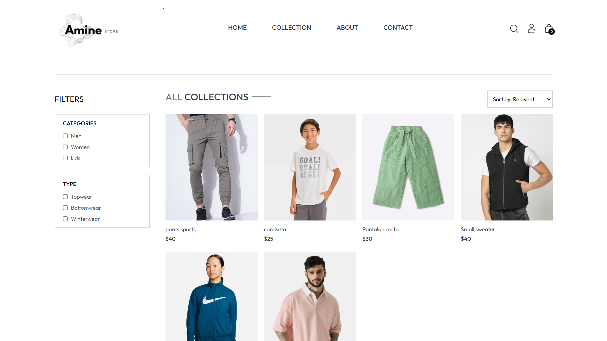
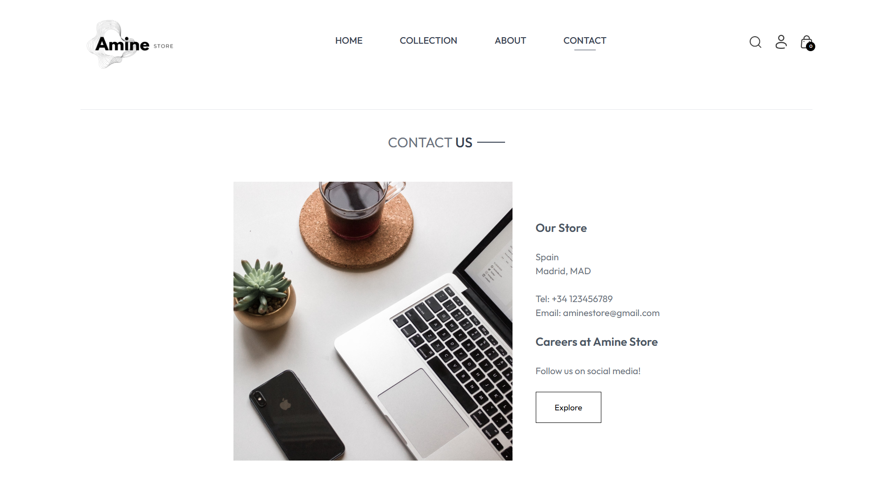
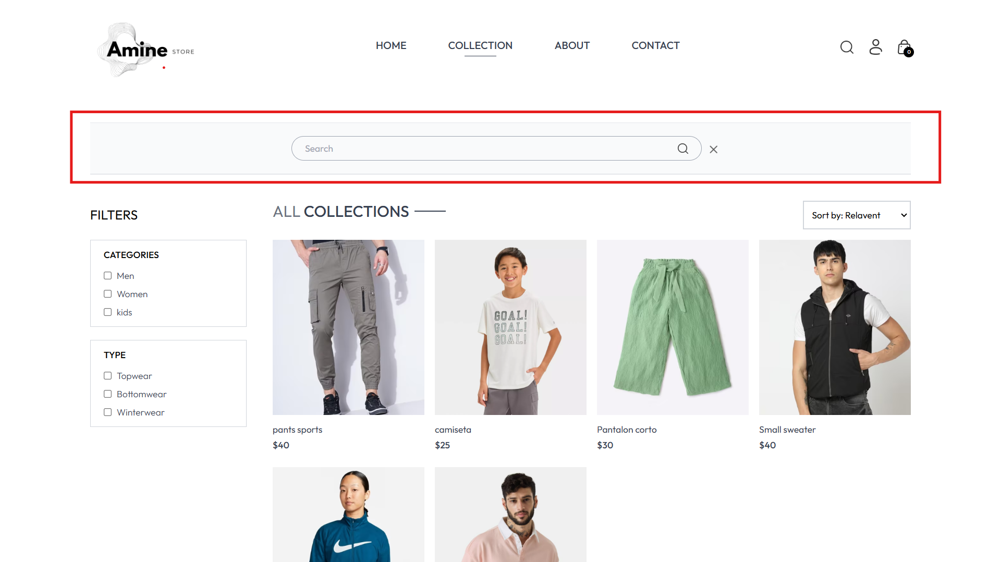
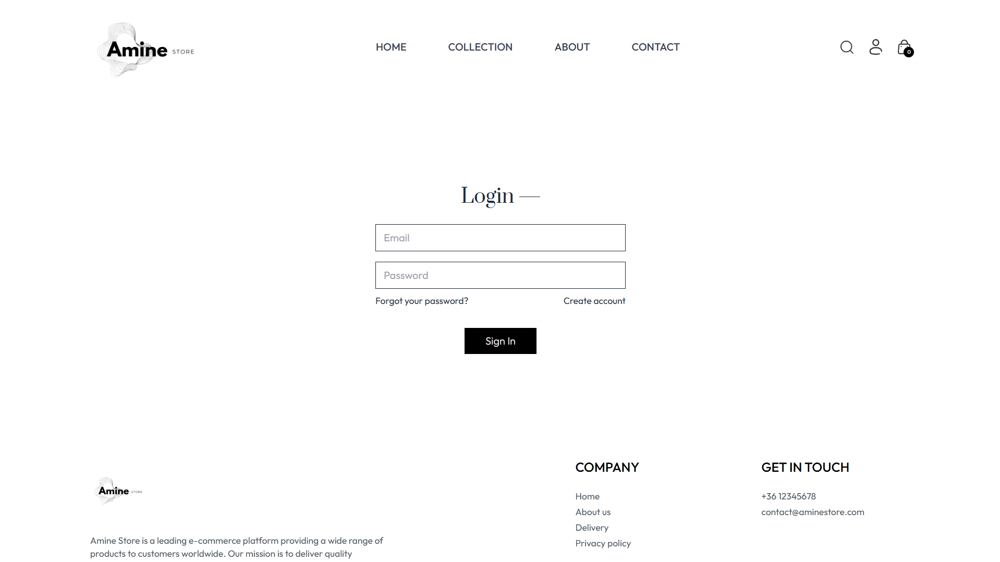
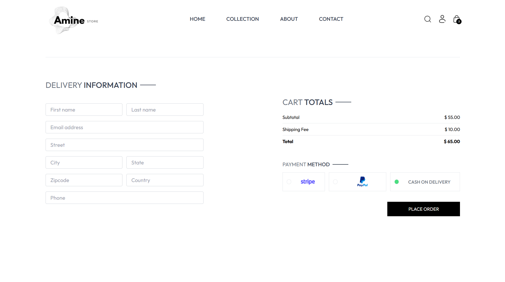
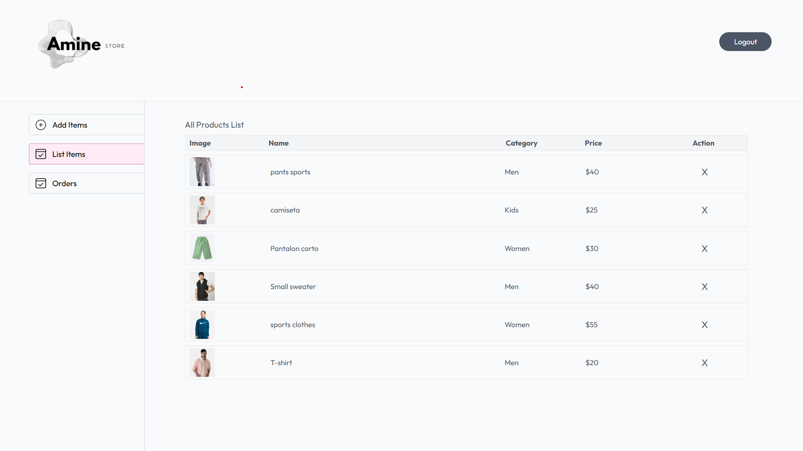
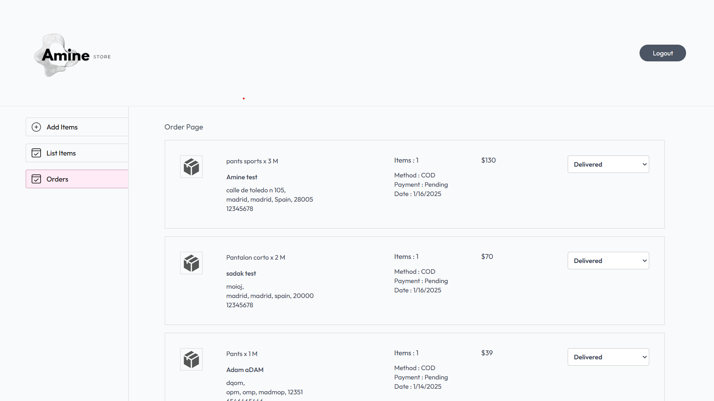
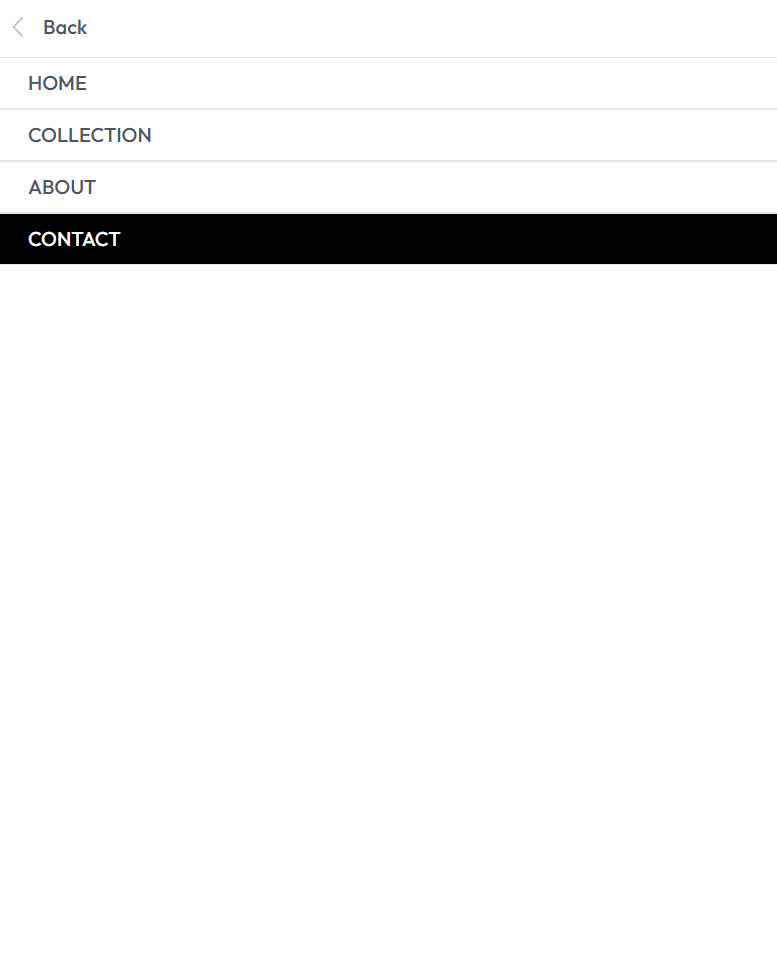

# 🛍️ E-Commerce Clothing Store

## 📌 Overview
A full-stack e-commerce web application where users can browse clothing products, manage a shopping cart, and authenticate securely. Admins have access to product management.

## 🚀 Features
- 🔑 **User Authentication** (Login/Register)  
- 🛒 **Shopping Cart** (Add/Remove items)  
- 🏷️ **Product Filtering & Search**  
- 📷 **Image Upload & Management** (Cloudinary)  
- 📊 **Admin Panel** (Manage Products & Users)  
- 📦 **Order Checkout (Future Implementation)**  

## 🛠️ Technologies Used
### **Frontend**
- ⚛ **React.js** (Component-based UI)
- 🎨 **TailwindCSS** (Responsive styling)

### **Backend**
- 🌍 **Node.js** (REST API)
- 🗄️ **MongoDB** (Database)
- 🔐 **JWT Authentication** (Secure login)
- ☁ **Cloudinary** (Image storage)

### **Deployment**(Coming soon) 
- 🌐 **Vercel** (Frontend)
- 🚀 **Render** (Backend)
- 📂 **MongoDB Atlas** (Cloud Database)

## 🔧 Installation & Setup

1️⃣ **Clone the Repository**
```bash
git clone https://github.com/yourusername/ecommerce-clothing-store.git
```

2️⃣ Navigate to the Project Folder
```bash
cd E-commerceStore
```

3️⃣ Install Dependencies
```bash
npm install
```

4️⃣ Run the Project
```bash
cd backend
npm run server
```
```bash
cd frontend
npm run dev
```
```bash
cd admin
npm run dev
```

## 📸 Screenshots

### 🏠 Homepage & Collections
| Homepage | Collections |
|----------|------------|
|  |  |

### ℹ️ About & Contact
| About | Contact |
|-------|---------|
|  |  |

### 🔍 Search
| Search |
|--------|
|  |

### 🔑 Authentication / Login
| Login |
|-------|
|  |

### 🛒 Shopping Cart & Checkout
| Add to Cart | Checkout |
|------------|---------|
|  |  |

### ⚙️ Admin Panel (Product Management & Orders)
| Add Product | Product List | Orders |
|------------|--------------|--------|
|  |  |  |

### 📱 Responsive Design  
| Mobile View | NavBar |
|------------|--------------|
|  |  |


⚡ Future Improvements
💳 Payment Integration (Stripe, PayPal, Cash on Delivery)
📦 Order Tracking System
🌎 Multi-Language Support


