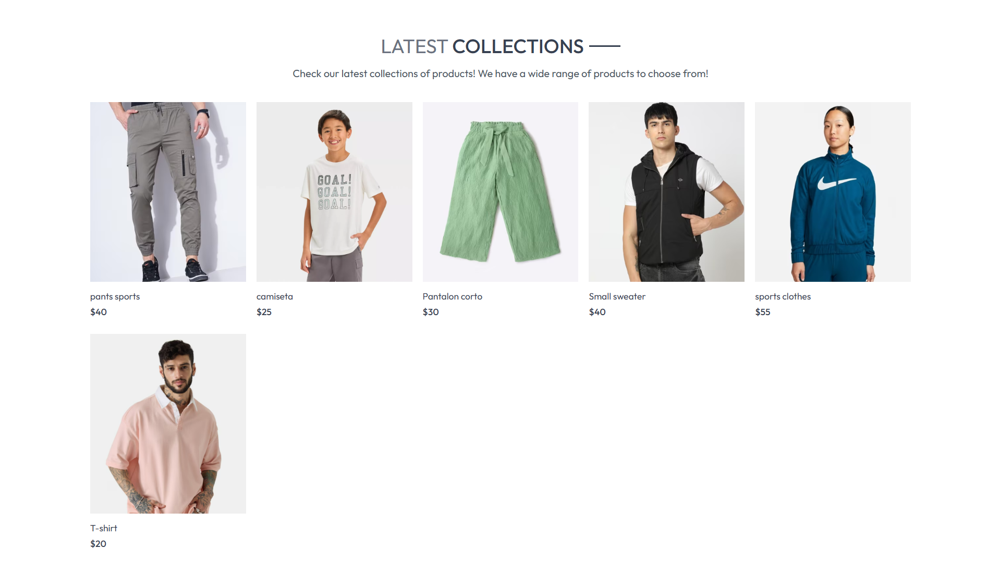
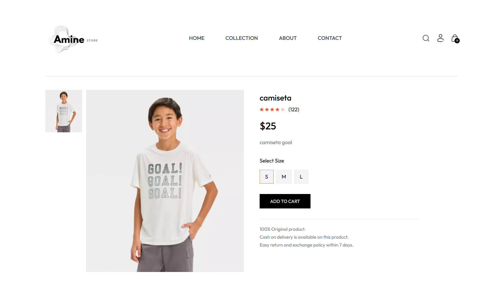

# 🛍️ E-Commerce Clothing Store

## 📌 Overview
A full-stack e-commerce web application where users can browse clothing products, manage a shopping cart, and authenticate securely. Admins have access to product management.

## 🚀 Features
- 🔑 **User Authentication** (Login/Register)  
- 🛒 **Shopping Cart** (Add/Remove items)  
- 🏷️ **Product Filtering & Search**  
- 📷 **Image Upload & Management** (Cloudinary)  
- 📊 **Admin Panel** (Manage Products & Users)  
- 📦 **Order Checkout (Future Implementation)**  

## 🛠️ Technologies Used
### **Frontend**
- ⚛ **React.js** (Component-based UI)
- 🎨 **TailwindCSS** (Responsive styling)

### **Backend**
- 🌍 **Node.js & Express.js** (REST API)
- 🗄️ **MongoDB & Mongoose** (Database)
- 🔐 **JWT Authentication** (Secure login)
- ☁ **Cloudinary** (Image storage)

### **Deployment**
- 🌐 **Vercel** (Frontend)
- 🚀 **Render** (Backend)
- 📂 **MongoDB Atlas** (Cloud Database)

## 🔧 Installation & Setup

1️⃣ **Clone the Repository**
```bash
git clone https://github.com/yourusername/ecommerce-clothing-store.git

2️⃣ Navigate to the Project Folder
cd ecommerce-clothing-store

3️⃣ Install Dependencies
npm install

4️⃣ Run the Project
npm start

## 📸 Screenshots

### 🏠 Home & Navigation
| Homepage | Homepage (Alt) | Collections |
|----------|--------------|-------------|
|  |  |  |

### 🛒 Shopping & Checkout
| Product List | Product Page | Add to Cart | Checkout |
|-------------|-------------|------------|---------|
|  |  |  |  |

### 🔍 Search & Orders
| Search | Orders | Contact |
|--------|--------|---------|
|  |  |  |

### 🔑 Authentication & User
| Login | About |
|-------|-------|
|  |  |


⚡ Future Improvements
💳 Payment Integration (Stripe, PayPal, Cash on Delivery)
📦 Order Tracking System
🌎 Multi-Language Support
